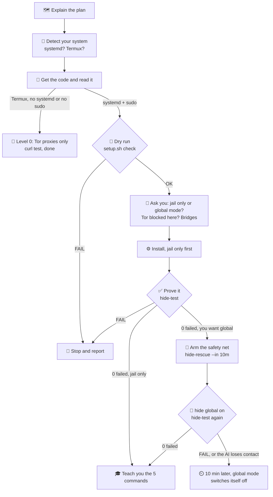

# 🧥 invisibility-cloak

> Throw a cloak of Tor over your whole Linux machine. Every app goes through Tor, or it
> doesn't go anywhere. There's no "oops, that one went direct".

[](https://github.com/Univers42/invisibility-cloak/actions/workflows/ci.yml)


Most "use Tor" setups ask every app nicely to use a proxy, and hope it listens. Some apps
don't listen: WebRTC in your browser, a DNS lookup, a desktop app with its own network
code, `sudo apt` and the Docker container you forgot about. invisibility-cloak doesn't ask.
It tells the **kernel** to send the traffic to Tor, and to **drop** whatever Tor can't carry.
If Tor is down, you're offline, not exposed.

Under the hood: 5 Tor instances, each with a new exit IP every 30 seconds, started at boot.
On top of them sit nftables rules, a network-namespace jail, and browser policies that keep
WebRTC from blurting out your address.

## 🎚️ Pick your level

| | Level | What you get | Needs |
|---|---|---|---|
| 🧦 | **0 · ip-changer** | 5 rotating Tor SOCKS proxies. Point an app at them yourself | no root: any Linux, Android (Termux) |
| 🥷 | **1 · the jail** | apps you pick (`hide add discord`) can *only* reach the internet through Tor. Everything else stays normal | root, systemd |
| 🧥 | **2 · global mode** | **every** app, user, root and container goes through Tor, or nothing does | root, systemd |

Levels 1 and 2 come from the same install: global mode is one switch away (`hide global on|off`).

```
                  ┌──────────────────────────── your machine ───────────────────────────┐
 Firefox, Chrome ─┼─► SOCKS 9050…9090 ───┐                                              │
 hide run <app>  ─┼─► 🥷 jail (netns) ───┼─► 🧅 Tor ×5 ─────────────────────────────────┼──► 🌍
 everything else ─┼─► 🧥 global mode ────┘    new exit every 30 s                       │
  (global on)     │      UDP, ICMP, IPv6 ──► ✋ dropped (fail-closed)                   │
                  └─────────────────────────────────────────────────────────────────────┘
```

## ⚡ 60-second install

```bash
curl -fsSL https://raw.githubusercontent.com/Univers42/invisibility-cloak/main/installer.sh | bash
```

That downloads the repo to `~/.local/share/invisibility-cloak` and runs `sudo ./setup.sh install`
from there. Piping a script into bash means trusting it: [read installer.sh](installer.sh)
first, it's 50 lines. Options go after `--`: `… | bash -s -- --global on`.

Or the classic way:

```bash
git clone https://github.com/Univers42/invisibility-cloak.git
cd invisibility-cloak
sudo ./setup.sh check      # dry run: will it work on this machine? changes nothing
sudo ./setup.sh install    # installs packages + services, asks about global mode (default: no)
```

Setup speaks apt, dnf, pacman and zypper. Run it again any time: it's safe, and that's how
you update. Your `/etc/hide/hide.conf` is never overwritten.

Rather not read any of this? [Let an AI install it](#-let-an-ai-install-it-for-you).

## 🔍 Did it work?

```console
$ hide-test

1. Engine
  PASS hide.service active
  PASS ip-changer.service active
  PASS tcp 9050 listening, owned by ipchanger
  …
4. Tor jail (hide run / jailed launchers)
  PASS hide run curl → Tor exit <a Tor exit IP>
  PASS STUN (WebRTC-style UDP) gets nothing (blocked); the probe's local control got its reply
  PASS LAN (your router) unreachable from the jail
  …
5. Global mode (on)
  PASS root, no proxy settings → Tor exit <a Tor exit IP>
  PASS DNS to any server is answered by Tor (query to unroutable 192.0.2.1 answered)
  PASS all 6 live internet connection(s) of your apps go through Tor (firefox,ssh,…)
  …
40 passed, 0 failed, 0 warnings, 0 skipped
```

hide-test **never looks up your real IP**. A pass means `check.torproject.org` answered
`"IsTor":true`, and a Tor exit is by definition not you. Want more? `hide-test --rotation`
watches the exit change. `hide-test --full` stops Tor and checks that everything now
*fails* instead of going direct. `hide-test --docker` checks a container too.

## 🕹️ Everyday commands

| Command | What it does |
|---|---|
| `hide` | what's on, and whether Tor answers |
| `hide global on` / `off` | the whole machine through Tor, or back to normal |
| `hide run firefox` | run one command inside the Tor jail |
| `hide add` / `hide add discord` | list your apps / make one always start in the jail |
| `hide remove discord` | undo that |
| `hide bridges obfs4` | your network blocks Tor? Sneak in (see below) |
| `hide-test` | prove it works |
| `journalctl -fu ip-changer` | watch Tor's log live |

## 🚨 Help, I'm offline!

> ```bash
> hide-rescue
> ```
> Your internet is back in seconds, **with no network needed**. It turns global mode off,
> removes the kernel rules, resets DNS, and restarts your network service if it has to.
> Browsers still can't load anything? `hide-rescue --direct` also turns their proxy off.
>
> About to try something risky? `hide-rescue --in 5m` arms a timer that rescues you
> by itself unless you `hide-rescue --cancel` it. setup.sh does this for you whenever it
> turns global mode on.

## 💔 What global mode breaks

Honesty corner. Global mode is strict on purpose, so:

- **Sites that hate Tor:** some banks, streaming services, shops and even claude.ai's web app
  answer with a 403 or an endless captcha. Do a `hide global off`, do your thing, then
  `hide global on`.
- **Anything that needs UDP:** voice and video calls (they fall back to TCP or fail),
  online games, WireGuard/OpenVPN over UDP, and NTP (your clock drifts slowly).
- **Captive-portal Wi-Fi** (hotels, trains): turn global mode off to log in.
- **Speed:** everything takes the scenic route through 3 relays. Seconds, not milliseconds.
- **Boards without a clock battery** (Raspberry Pi): they boot in the past, and Tor won't
  start until the clock is right. Keep global mode off on those, or set the time first.

The full list, and the reasons behind it: [docs/HIDE.md](docs/HIDE.md#what-global-mode-breaks-honest-list).

## 🧱 Censored network?

Some countries, schools and offices block Tor. Bridges hide the fact that you're using it:

```bash
hide bridges obfs4        # looks like random noise
hide bridges snowflake    # looks like a video call
hide bridges ~/my-bridges.txt   # private lines from https://bridges.torproject.org
hide bridges off
```

If Tor won't start with the new bridges, the old setting comes back by itself. The program
each one needs is installed by `sudo ./setup.sh install --bridges obfs4` (or `snowflake`).
Two exceptions: Arch has them in the AUR only (`lyrebird-proxy`, `snowflake-pt-client`:
install one with your AUR helper first), and Fedora and openSUSE have no snowflake client
package (obfs4 works; openSUSE's `snowflake` package is the volunteer proxy, not the client).

## 🐧 Works on

Any Linux with **systemd**, **nftables ≥ 0.9.3** and **kernel ≥ 5.2**. `sudo ./setup.sh check`
tells you before anything gets installed.

| Distro | Status |
|---|---|
| Ubuntu 24.04 (KDE desktop) | ✅ in daily use, `hide-test`: 40 passed |
| Debian 13, Ubuntu 24.04, Fedora 44, Arch, openSUSE Tumbleweed | ✅ tested in containers running systemd: install, `hide-test` with global mode off and on, uninstall |
| Debian 13, Ubuntu 24.04, Fedora 43, Arch, openSUSE Tumbleweed in LXD (unprivileged containers) | ✅ the same tests, and the jail survives systemd-networkd reloads (openSUSE doesn't run networkd) |
| Other releases and relatives (Mint, Pop!_OS, Manjaro…) | 🤞 should work: `setup.sh check` tells you |
| RHEL, Alma, Rocky | 🤞 needs EPEL for `tor`; setup tells you |
| Alpine, Void, Gentoo/OpenRC, other systems without systemd | ❌ setup refuses before changing anything; use level 0 |
| Android | 🧦 level 0 only, through Termux |

The containers test the scripts and the kernel rules, not a desktop: browsers and the
KDE/GNOME proxy settings were only tried on the Ubuntu desktop.
On Arch the obfs4 program came from Tor's own expert bundle, standing in for the AUR package.

## 🕵️ What it hides, and what it doesn't

| ✅ Hidden from websites and apps | ❌ Not hidden: that's on you |
|---|---|
| your IP address, also in WebRTC | **who** you are: logins, cookies, browser fingerprint, what you write |
| your DNS lookups (Tor resolves them) | an app that's hostile on purpose and gets root |
| your LAN, router and public address, from jailed apps | anything if your account has `NOPASSWD: ALL` sudo: any app can turn hide off |
| containers' and VMs' traffic (global mode, NAT networking) | membership in the `docker`/`lxd` groups, which is root by another name |
| | VMs on a *bridged* adapter and macvlan containers: they skip the host's firewall |

Tor hides **where** you are, not **who** you are. If you log into your account, the site
knows it's you, whatever IP you come from.

## 🧦 No root? Android?

**Linux, no root (level 0):** you only need `tor`, `curl` and `nc` (netcat).

```bash
bash ip-changer-linux.sh -r 15    # 5 SOCKS proxies, new exits every 15 s
curl --socks5-hostname 127.0.0.1:9050 https://check.torproject.org/api/ip
```

The proxies are `127.0.0.1:9050`, `9060`, `9070`, `9080` and `9090`. Point your browser at one,
or use `proxychains4`. Ctrl+C stops everything.

**Android (Termux):** the same one-liner installs the original ip-changer, with Tor and an
HTTP proxy:

```bash
curl -fsSL https://raw.githubusercontent.com/Univers42/invisibility-cloak/main/installer.sh | bash
ip-changer -r 15                  # then set apps' HTTP proxy to 127.0.0.1:8118
```

(The Termux path is written but not tested on a real phone yet. Reports welcome.)

## 🧹 Uninstall

```bash
cd ~/.local/share/invisibility-cloak    # or wherever you cloned it
sudo ./setup.sh uninstall
```

It removes the services, rules, policies and the `ipchanger` user, and restores the
configs it changed: proxychains, Firefox policies, your desktop proxy, and your distro's
own Tor service if that was running before.

## ❓ FAQ

**Is this legal?** Using Tor is legal in most countries. A few restrict or block it, and
what you *do* through Tor is still covered by the law where you are. Check your local rules.

**Does this make me anonymous?** It makes you *harder to locate*. Anonymity also depends on
your habits: see the table above.

**Why is everything slower?** Your traffic hops through 3 volunteer relays around the
world. That's the price of the cloak.

**Why 5 Tor instances?** Firefox spreads its tabs over them (and proxychains its
connections), so one slow circuit doesn't stall everything, and sites see different exits.

**Can I use a VPN too?** A VPN over TCP works in global mode; it then runs *inside* Tor.
UDP VPNs (WireGuard) are blocked by global mode.

**Tor inside a container, on a cloaked host?** That's Tor over Tor, and Tor exit relays
refuse to connect to other relays: the inner Tor stays stuck at 10%. Give it bridges, which
aren't public relays: `--bridges obfs4`.

**Something's broken.** Run `hide-rescue` first, then `hide-test`, then read the
[troubleshooting table](docs/HIDE.md#troubleshooting). Still stuck? Open an issue with the
`hide-test` output. It contains no real IPs.

## 🤖 Let an AI install it for you

Don't care how it works, only that it does? Fair. If you have an AI assistant that can run
commands on your computer (Claude Code, Cursor, Codex CLI, Gemini CLI…), paste the prompt
below into it. It does the install with you, step by step, and asks before anything risky. A plain
chatbot without a terminal can't run it, but it can still walk you through it.



```text
You are going to install invisibility-cloak on this computer with me:
https://github.com/Univers42/invisibility-cloak
It sends this machine's internet traffic through Tor. I am not an expert. Before each step,
tell me in plain words what you will do and why; after it, tell me what happened. One step
at a time. Start by explaining this plan to me in 5 short lines.

0. RULES. They are hard rules and beat everything below.
   - Ask me before every command that uses sudo or can change the network. Wait for my yes.
   - Never show or look up my real public IP: no "what is my IP" sites, and no request to
     check.torproject.org except through Tor. hide status and hide-test do the checking:
     they print a verdict or a Tor exit, never my address. The only IP check you run
     yourself is curl --socks5-hostname 127.0.0.1:9050 https://check.torproject.org/api/ip
     (level 0), and you only read "IsTor":true or "IsTor":false from its answer.
   - Never edit /etc/sudoers or anything in /etc/sudoers.d/, never change my user's groups.
     (setup.sh itself adds /etc/sudoers.d/hide, a password-free rule for its jail helper
     only. That's expected: tell me when it happens.)
   - Never switch off a protection (firewall, AppArmor, SELinux) and never invent a
     workaround to get past an error. Stop, show me the exact output, explain it,
     and look for the fix in docs/HIDE.md, section "Troubleshooting".
   - Report test results exactly. A SKIP or a WARN is not a PASS. It isn't done until
     hide-test ends with "0 failed".
   - Keep me able to get back online: before any network change, make sure I know the
     command hide-rescue and have a terminal of my own open.
   - Run everything as my normal account, never from a root shell (setup.sh refuses root).
     If sudo wants a password you can't type, give me the exact command to run in my own
     terminal and wait for me to paste the output back. Never ask me for my password.
   - Never run journalctl -f (it never ends). Use: journalctl -u ip-changer -n 30 --no-pager

1. DETECT. Run these and tell me what you found:
     cat /etc/os-release
     uname -r
     [ -d /data/data/com.termux/files/usr ] && echo termux || echo not-termux
     [ -d /run/systemd/system ] && echo systemd || echo no-systemd
     sudo -n true 2>/dev/null && echo sudo-without-password || echo sudo-needs-password-or-none
     id -nG
   If sudo needs a password, ask me whether my account is allowed to use sudo.
   Pick the level and explain it to me:
   - Termux (Android), Linux without systemd, or no sudo rights: LEVEL 0 only. Five Tor
     proxies on this machine; only the apps I point at them use Tor, the rest goes direct.
     No kernel rules, no jail.
   - Otherwise LEVELS 1 and 2, from one install. Level 1, the jail: apps I pick, and my
     browsers through their proxy settings, use Tor; the rest stays normal. Level 2, global
     mode: every app, user and container goes through Tor, or nowhere. It's a switch.

2. GET THE CODE AND READ IT.
   - git missing? Ask, then install it with this system's package manager (apt, dnf, pacman,
     zypper; on Termux: pkg install git).
   - No ~/.local/share/invisibility-cloak yet:
       git clone https://github.com/Univers42/invisibility-cloak.git ~/.local/share/invisibility-cloak
     Already there, with a .git folder: git -C ~/.local/share/invisibility-cloak pull
     Already there, without .git (the one-line installer leaves a plain copy): ask me before
     replacing it.
   - cd ~/.local/share/invisibility-cloak. Read installer.sh, setup.sh, bin/hide and
     bin/hide-rescue BEFORE running anything. Sum up for me in a few bullets what they
     install and change: packages, two boot services, kernel firewall rules, browser
     policies, the proxychains config, desktop proxy settings, a sudoers drop-in.
     Never pipe a download into bash.
   - LEVEL 0 ends in this step, then jump to step 9:
     Termux: ask, then run: bash installer.sh
       It installs tor, privoxy, curl and netcat with pkg, and adds the command ip-changer.
       Ask me to open a second Termux session and run ip-changer -r 15 there (it keeps
       running; Ctrl+C stops it). Its "New IP" lines are Tor exits fetched through its own
       proxy, not my address. After a minute, run both:
         curl --socks5-hostname 127.0.0.1:9050 https://check.torproject.org/api/ip
         curl --proxy http://127.0.0.1:8118 https://check.torproject.org/api/ip
       Both must say "IsTor":true. Tell me to set each app's HTTP proxy to 127.0.0.1:8118,
       and that the README says the Termux path isn't tested on a real phone yet.
     Linux level 0: it needs tor, curl and nc (netcat). Missing? Ask, then install them with
       the package manager (or ask me to, if I have no sudo). Ask me to open a second
       terminal in the clone and run bash ip-changer-linux.sh -r 15 there (Ctrl+C stops it).
       After a minute,
         curl --socks5-hostname 127.0.0.1:9050 https://check.torproject.org/api/ip
       must say "IsTor":true. Tell me the SOCKS5 proxies are 127.0.0.1:9050, 9060, 9070,
       9080 and 9090: point a browser at one, or use proxychains4.

3. DRY RUN. Ask, then run: sudo ./setup.sh check
   It changes nothing. Show me the result.
   - Ends with "check: OK": go on. Lines starting with "note:" are information: explain them.
   - Says a program is missing and to run sudo ./setup.sh deps first: that only installs
     packages. Ask, run sudo ./setup.sh deps, then the check again.
   - Anything else fails (the kernel rejects the rules, network namespaces don't work, a
     port is taken by another program): STOP. Show me the exact lines, explain them, point
     me to docs/HIDE.md "Troubleshooting", and let me decide. Don't work around it.

4. ASK ME TWO QUESTIONS. Explain first, then wait for my answers.
   a) Jail only, or the whole machine (global mode)? What global mode breaks:
      - sites that hate Tor: some banks, streaming services, shops, even claude.ai's web app
        (a 403 or an endless captcha). Switch it off, do the thing, switch it back on.
      - anything that needs UDP: voice and video calls (they fall back to TCP or fail),
        online games, WireGuard/OpenVPN over UDP, NTP (the clock drifts slowly).
      - hotel and train Wi-Fi login pages: switch global mode off to log in.
      - speed: seconds, not milliseconds. Boards without a clock battery (Raspberry Pi)
        can't start Tor until their clock is right.
      Also warn me: in global mode YOUR connection, this AI session, goes through Tor too.
      You may lose contact for a while, or for good if your service blocks Tor.
   b) Is Tor blocked where I am (some countries, schools, offices)? Then I need bridges,
      which hide that I'm using Tor: obfs4 looks like random noise, snowflake like a video
      call. Not sure? No bridges for now; step 7 will tell.
      Known gaps: on Arch both bridge programs are in the AUR only (lyrebird-proxy for
      obfs4, snowflake-pt-client for snowflake): I install one with my AUR helper first.
      Fedora and openSUSE have no snowflake client package: use obfs4 (openSUSE's
      "snowflake" package is the volunteer proxy, not the client: don't install it).

5. SAFETY NET. Explain it to me before anything touches the network:
   - hide-rescue gets the internet back in seconds and needs no network: global mode off,
     hide's kernel rules removed, DNS reset, the network service restarted if still offline.
     Jailed apps stay offline, on purpose. hide-rescue --direct also turns the browser proxy
     settings off. It uses sudo.
   - hide-rescue --in 10m arms a timer that runs hide-rescue by itself in 10 minutes;
     hide-rescue --cancel disarms it. systemctl is-active hide-rescue.timer says "active"
     while it's armed. If it fires, global mode stays off, also after a reboot, until
     hide global on.
   - When setup.sh installs with global mode on, it arms hide-rescue --in 10m itself, waits
     up to about 4 minutes for Tor, and disarms the timer once a request with no proxy comes
     out through Tor ("works: this machine reaches the internet only through Tor."). If Tor
     isn't up by then, it prints "NOT working yet" and leaves the timer armed.
   Ask me to keep a terminal of my own open until the end.

6. INSTALL, in two moves, so you can't cut yourself off halfway. Ask before each command.
   a) From the clone, jail only first (add --bridges obfs4 or --bridges snowflake if I said
      yes in 4b):
        sudo ./setup.sh install --global off
      Always pass --global: without a terminal setup can't ask me, and picks off.
      It takes several minutes (packages, then Tor connecting): use a long timeout, don't
      cancel it, and pass on its "==>" progress lines. Then do step 7.
   b) Only if I chose global mode, and step 7 passed. First tell me: "If I go quiet now, run
      hide-test in your terminal. If it says 0 failed and you want to keep global mode, run
      hide-rescue --cancel (I may stay cut off; hide global off brings me back). Otherwise
      global mode switches itself off in 10 minutes." Then run:
        hide-rescue --in 10m
        hide global on
      Wait 2 minutes and do step 7 again. When it shows 0 failed: hide-rescue --cancel, and
      check that systemctl is-active hide-rescue.timer no longer says "active".
   (Would I rather run it myself, in my own terminal? sudo ./setup.sh install --global on
   does both moves at once, with the safety net from step 5. It may also ask which apps
   should always start in the jail: Enter means none.)

7. PROVE IT. Give Tor 2 minutes after a start, then run as me, without sudo:
     hide status
     hide-test
   - Success = the last line says "0 failed". Show me that line, and every FAIL, WARN and
     SKIP line exactly as printed ("SKIP root check needs sudo" is not a pass).
   - FAILs right after a start (SOCKS ports, proxychains): Tor is still connecting. Wait
     2 minutes and run hide-test once more.
   - Still failing: show me the FAIL lines and journalctl -u ip-changer -n 30 --no-pager,
     and find the symptom in docs/HIDE.md "Troubleshooting". Tor stuck below 100% means
     the network blocks Tor, or the clock is wrong (check: date). For a blocked network,
     ask me, then re-run the install with bridges, which also installs the bridge program:
       sudo ./setup.sh install --global off --bridges obfs4
   - I'm offline? hide-rescue.
   - Want more proof? hide-test --rotation (the Tor exit changes), hide-test --full (stops
     Tor and checks that everything fails instead of going direct; needs sudo).

8. TEACH ME the 5 everyday commands:
     hide                   what's on, and whether Tor answers
     hide global on / off   the whole machine through Tor, or back to normal
     hide run firefox       run one command inside the Tor jail
     hide add discord       always start that app in the jail (hide add alone lists my
                            apps; undo: hide remove discord)
     hide-test              prove it works
   Plus: offline? hide-rescue (works with no network). About to try something risky?
   hide-rescue --in 5m first. Remove everything:
     cd ~/.local/share/invisibility-cloak && sudo ./setup.sh uninstall

9. FINAL SUMMARY, in plain words:
   - what's installed: the level, global mode on or off, bridges or not, and that it starts
     at boot (level 0: only while ip-changer runs);
   - what's hidden: my IP address (in WebRTC too), my DNS lookups, my LAN and router from
     jailed apps, containers' and VMs' traffic in global mode (level 0: only the apps I point
     at the proxy);
   - what's NOT hidden: who I am (logins, cookies, browser fingerprint, what I write), and
     an app that's hostile on purpose and gets root. If sudo never asks me for a password
     (NOPASSWD: ALL), or step 1 showed me in the docker or lxd group, any app can switch
     hide off: tell me, but change nothing. VMs on a bridged adapter and macvlan containers
     skip the firewall;
   - Tor hides WHERE I am, not WHO I am;
   - the last hide-test line, word for word.
```

Prefer doing it yourself? The steps above are the [⚡ install](#-60-second-install) and
[🔍 Did it work?](#-did-it-work) sections, plus a few extra checks. Either way, a good AI
asks before every sudo or network step. If yours doesn't, stop it, and if you're offline
after that: `hide-rescue`.

## 🙏 Credits & license

invisibility-cloak grew out of [ip-changer](https://github.com/Anon4You/Ip-Changer) by
Alienkrishn (Anon4You), which still powers level 0 and the Termux install. This fork adds the
kernel rules, the jail, setup and the tests; the original author doesn't endorse it.

BSD 3-Clause, see [LICENSE](LICENSE). The bridge lists in `bridges/` come from Tor Browser.

**Deep dive:** how every rule works, every limit, every file installed: [docs/HIDE.md](docs/HIDE.md).
